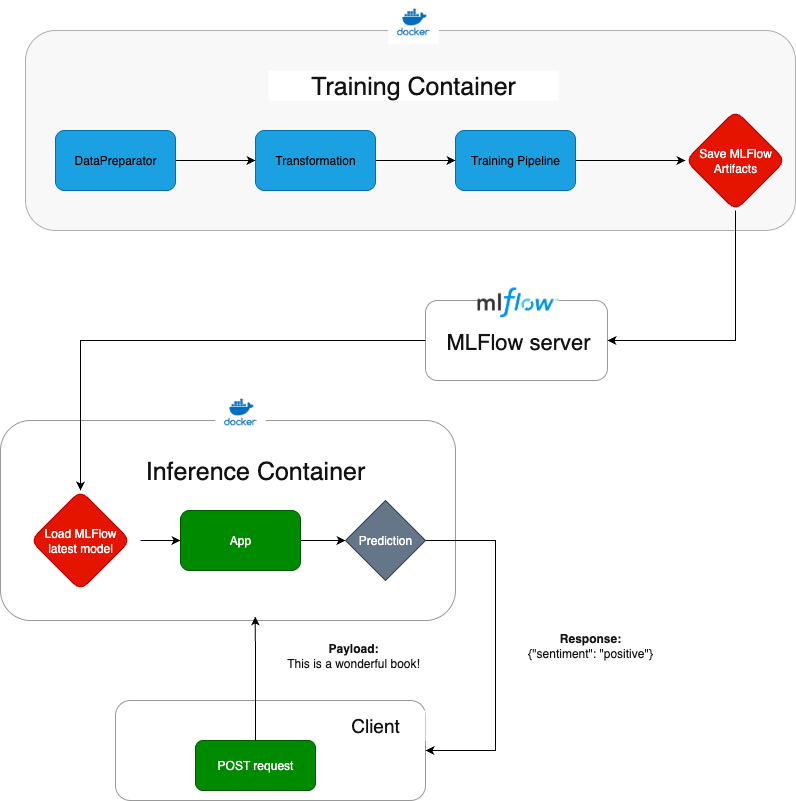
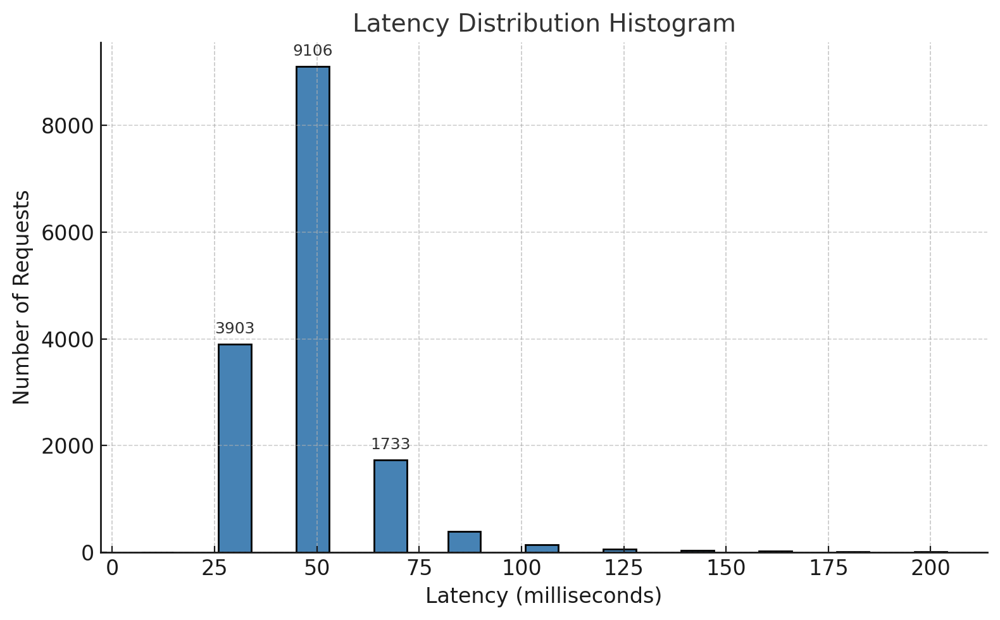

# MLOps Reviews Sentiment Prediction
This project trains and serves a **sentiment classifier** that categorizes review sentences into **positive**, **neutral**, or **negative** classes.  
Each review is split into individual sentences, and each sentence inherits the review’s star rating as its label.

<br>


## 🧠 Project Overview

The project includes:
1. **Training pipeline** to preprocess data, extract features, and train a classifier.
2. **FastAPI app** that serves predictions locally with **p99 latency ≤ 300 ms**.
3. **Containerization** for easy local or cloud deployment.

<br>

## Architecture



<br>

## Project folders
```
main/
│
├── code/
│   ├── sentimentpredictor/
│   │   ├── config/
│   │   ├── train/
│   │   ├── prediction/
│   │   ├── preprocessing/
│   │   └── preprocessing/
│   └── tests/
│      
├── data/
├── notebooks/
├── inference.dockerfile
├── training.dockerfile
├── requirements-dev.txt
└── requirements.txt
```

<br>

## How to run:
### Requirements
- python3.10
- docker
- mlflow

<br>


### Run:

- MLFlow server
```bash
mlflow server \
  --backend-store-uri sqlite:///mlruns/mlflow.db \
  --serve-artifacts \
  --host 0.0.0.0 \
  --port 5001
```

- Model Training 
```bash
docker build -t tfidf-sentiment-train -f training.dockerfile .
docker run --rm  -e MLFLOW_TRACKING_URI=http://host.docker.internal:5001 \
  -e MLFLOW_S3_IGNORE_TLS=true \
  tfidf-sentiment-train
```

- Inference Server API
```bash
docker build -t tfidf-sentiment -f inference.dockerfile .
docker run -p 8000:8000 \
  --add-host=host.docker.internal:host-gateway \
  -e MLFLOW_TRACKING_URI=http://host.docker.internal:5001 \
  -e MODEL_URI=models:/sentiment-predictor/Production \
  tfidf-sentiment
  ```

- Test deployed server:
```bash
curl -X POST localhost:8000/predict -H 'Content-Type: application/json' \
-d '{"sentences":["I loved this", "meh", "terrible product", "product is ok, can be better"]}'

```
- Output Example
```python
{
  "sentiments": [
    "positive","negative","negative","neutral"
  ]
}
```

- Run pytest:
```bash
pytest -vv
```

<br>


<br>

## ⚡ Performance Benchmark
```bash
hey -z 30s -c 20 -m POST -H "Content-Type: application/json" \
  -d '{"sentences": ["great book!", "meh", "terrible"]}' \
  http://localhost:8000/predict
```
**Endpoint tested:** `POST /predict`  
**Payload:** `{"sentences": ["great book!", "meh", "terrible"]}`  
**Test duration:** 30 seconds  
**Concurrency:** 20 clients  

### 📊 Summary
| Metric | Result |
|---------|---------|
| **Total duration** | 30,02 seconds |
| **Requests/sec** | 513,94 |
| **Average latency** | 38,9 ms |
| **Fastest request** | 10,9 ms |
| **Slowest request** | 199,7 ms |
| **Total responses** | 15,428 |
| **Successful (200)** | 100% |
---
### ⏱️ Latency distribution

| Percentile | Latency |
|-------------|----------|
| 10% | 25 ms |
| 25% | 29.7 ms |
| 50% (median) | 35.6 ms |
| 75% | 43.6 ms |
| 90% | 54.5 ms |
| 95% | 64.8 ms |
| **99% (p99)** | **102.9 ms ✅** |

> **p99 latency < 300 ms target achieved**

---

### 📈 Response time histogram



---
- **p99 latency = 102.9 ms**, meeting the **<300 ms requirement**.  
- No failed requests; consistent throughput (~514 req/sec).  
- The deployment is suitable for local and cloud scaling (Docker-ready).
